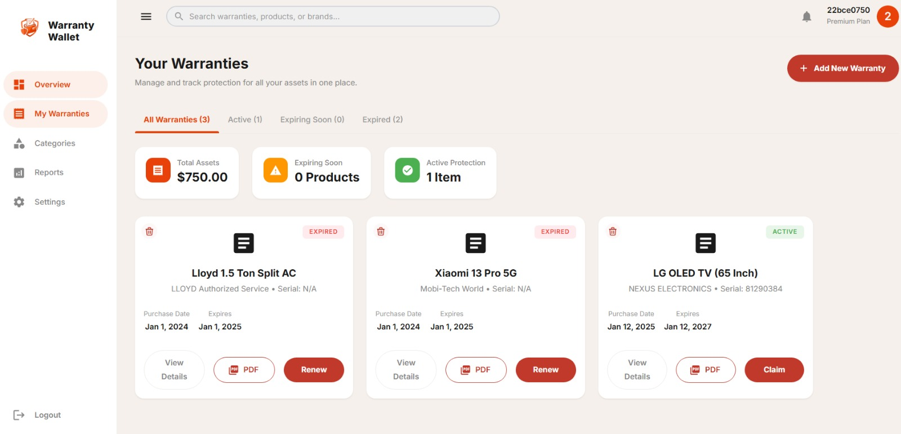

# Warranty Wallet

**Never lose a warranty again.**

Warranty Wallet turns messy purchase receipts into smart, structured, searchable digital records using AI. Upload a bill image → Gemini extracts all key details → expiry dates are calculated automatically → you get timely reminders and a beautiful "Warranty Passport" PDF.

Stop digging through old emails and crumpled bills. Keep every warranty in one clean dashboard with smart status tracking (Active / Expiring Soon / Expired).


<!-- Add your actual screenshots here: dashboard, upload flow, PDF preview, etc. -->

## Key Features

- AI-powered receipt scanning using **Gemini 1.5 Flash** (extracts invoice date, product name, serial/model, merchant, price, warranty period, etc.)
- Automatic expiry calculation with smart status: **ACTIVE**, **EXPIRING_SOON**, **EXPIRED**
- Secure original bill storage in Cloudinary
- One-click "Warranty Passport" PDF export (data + embedded image)
- Scheduled email reminders (30, 7, and 1 day before expiry)
- Authentication: username/password + Google & GitHub OAuth
- User notification preferences

## Architecture: Async Processing with Redis (Upstash)

Async Scan Pipeline with Redis

The `/scan` endpoint uses a Redis (Upstash) based background job queue.

- Upload request pushes the image to a Redis queue and returns immediately (< 1 second response time).
- A background worker consumes the job, runs Gemini 2.5 Flash extraction, processes the warranty data, and stores the result in MongoDB + Cloudinary.
- This completely decouples heavy AI work from HTTP requests, preventing blocking and timeouts.


1. User uploads image → Job is pushed to Redis queue → HTTP response returns **under 1 second**.
2. Background worker consumes the job, performs Gemini extraction + business logic.
3. Results (structured warranty data + Cloudinary URL) are saved to MongoDB.
4. User can see the processed record shortly after (via polling or dashboard refresh).

This decoupling made the API responsive, improved scalability for multiple users, and eliminated timeout issues.

**Tech used for this:** Spring Boot + Redis (Upstash) + background workers.

## How It Works
```text
React + Vite Frontend
        ↓ (fast upload)
    Spring Boot API
        ↓
├── Redis (Upstash)      → Job queue for async processing
├── Gemini 1.5 Flash     → Structured receipt extraction (in background worker)
├── MongoDB              → Users + warranty records
├── Cloudinary           → Original bill image storage
└── Spring Scheduler + SMTP → Email reminders
```

## Tech Stack

| Layer              | Technologies |
|--------------------|--------------|
| **Frontend**       | React 19, Vite 7, Material UI 7, React Router 7, Axios |
| **Backend**        | Spring Boot 3.2, Java 17, Spring Security, JWT, OAuth2, **Spring Data Redis** |
| **Queue / Async**  | **Redis (Upstash)** – Background job queue for OCR/extraction |
| **Database**       | MongoDB |
| **AI**             | Gemini 1.5 Flash |
| **Storage**        | Cloudinary |
| **Documents**      | jsPDF + jspdf-autotable |
| **Alerts**         | Spring Mail + Scheduled Jobs |
| **Deployment**     | Docker, Render (backend), Vercel (frontend) |

## Repository Structure

```text
warranty-wallet/
|-- backend/                     Spring Boot API
|   |-- src/main/java/com/warrantywalket/
|   |   |-- config/              security, Redis, and app configuration
|   |   |-- controller/          REST endpoints
|   |   |-- dto/                 request and response models
|   |   |-- model/               MongoDB entities
|   |   |-- repository/          data access
|   |   |-- security/            JWT and OAuth2 handling
|   |   `-- service/             Async workers, OCR, alerts, Cloudinary
|   `-- src/main/resources/
|       `-- application.properties
|-- frontend/                    React application
|   |-- src/components/          layout, upload, and warranty cards
|   |-- src/pages/               login, dashboard, settings, reports, categories
|   `-- src/services/            API client and PDF export
|-- Dockerfile                   backend container build
|-- render.yaml                  backend deployment config
|-- vercel.json                  frontend SPA routing config
```

## Quick Start / Local Development

### Prerequisites

- Java 17+
- Maven 3.9+
- Node.js 20+
- MongoDB instance (local or Atlas)
- Cloudinary account
- Gemini API key
- Redis (Upstash) instance
- SMTP credentials for emails

### Environment Variables

Set these before starting the backend:

| Variable | Required | Purpose |
| --- | --- | --- |
| `SPRING_DATA_MONGODB_URI` | Yes | MongoDB connection string |
| `JWT_SECRET` | Yes | Secret used to sign JWTs |
| `CLOUDINARY_URL` | Yes | Cloudinary connection URL |
| `GEMINI_API_KEY` | Yes | Gemini API key for receipt extraction |
| `UPSTASH_REDIS_URL` | Yes | Upstash Redis connection URL |
| `UPSTASH_REDIS_TOKEN` | Yes | Upstash token (if using REST) |
| `SMTP_EMAIL` | No | Sender email for alert notifications |
| `SMTP_PASSWORD` | No | Sender app password for SMTP |

### Start Commands

**Backend:**
```powershell
cd backend
mvn spring-boot:run
```

**Frontend:**
```powershell
cd frontend
npm install
npm run dev
```

## Core API Endpoints

| Method | Route | Description |
| --- | --- | --- |
| `POST` | `/api/auth/signup` | Register a new user |
| `POST` | `/api/auth/login` | Authenticate and receive a JWT |
| `POST` | `/api/warranties/scan` | Upload a bill image (Async Queue) |
| `GET` | `/api/warranties` | Fetch all user warranties |
| `DELETE` | `/api/warranties/{id}` | Delete a warranty record |
| `GET` | `/api/user/settings` | Load notification settings |

## Current Scope & Roadmap

### Completed:
-  Full auth flow (JWT + OAuth2)
-  **Async Redis-based scan pipeline** (Fast upload + background processing)
-  Warranty management with automatic expiry tracking
-  Cloudinary storage + "Warranty Passport" PDF export
-  Smart status classifying (Active / Expiring Soon / Expired)
-  Scheduled email reminders

### Upcoming:
-  Rich analytics & reports module
-  Advanced category / tagging system
-  Real-time progress updates for scan jobs (WebSocket)
-  Dark mode + fully optimized mobile experience

## Contributing
Contributions and feedback welcome!
