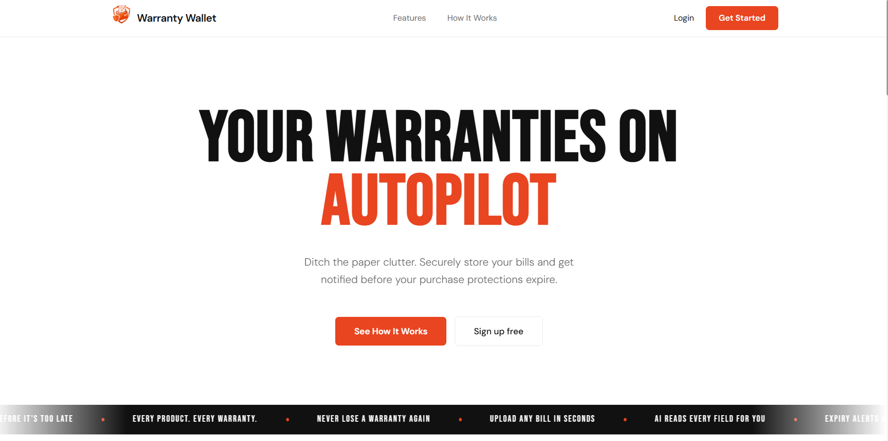

# Warranty Wallet

**Never lose a warranty again.**

Warranty Wallet turns messy purchase receipts into smart, structured, searchable digital records using AI. Upload a bill image → Gemini extracts all key details → expiry dates are calculated automatically → you get timely reminders and a beautiful "Warranty Passport" PDF.

Stop digging through old emails and crumpled bills. Keep every warranty in one clean dashboard with smart status tracking (Active / Expiring Soon / Expired).



---

## Key Features

- **AI-powered receipt scanning** using a **Gemini 2.5 Flash** model chain with automatic fallback (`gemini-2.5-flash` → `gemini-2.5-flash-lite` → `gemini-2.0-flash`)
- Intelligent **retry logic** with configurable attempts and initial backoff delay
- Automatic expiry calculation with smart status: **ACTIVE**, **EXPIRING_SOON**, **EXPIRED**
- Secure original bill storage in **Cloudinary**
- One-click **"Warranty Passport" PDF export** (data + embedded image)
- Scheduled email reminders **(30, 7, and 1 day before expiry)**
- Authentication: username/password + **Google & GitHub OAuth2**
- Real-time **queue position & estimated wait time** during scan
- User notification preferences dashboard

---

## Architecture: Async Processing with Redis (Upstash)

The `/scan` endpoint uses a Redis (Upstash) based background job queue that completely decouples heavy AI work from the HTTP request lifecycle.

### Flow

```
1. User uploads image
       ↓
2. Job pushed to Redis queue → HTTP response returns in < 1 second
       ↓
3. Background OcrWorker acquires a Semaphore slot (max 2 concurrent Gemini calls enforced)
       ↓
4. OcrService tries Gemini models in priority order with per-model retry logic
       ↓
5. Results (structured warranty data + Cloudinary URL) saved to MongoDB
       ↓
6. User polls /scan/status/{jobId} — receives: queue position, estimated wait, and final result
```

**Why this matters:**
- API stays responsive even under heavy AI workload
- Built-in concurrency cap (`Semaphore`) keeps usage within Gemini free-tier limits
- Model cascade ensures extraction succeeds even if the primary model is unavailable

**Tech used:** Spring Boot · Redis (Upstash / Lettuce) · Semaphore · Gemini API

---

## How It Works

```text
React + Vite Frontend
        ↓ (< 1s upload response)
    Spring Boot API
        ↓
├── Redis (Upstash / Lettuce)   → Async job queue
├── OcrWorker (Semaphore: 2)    → Concurrency-capped background processor
├── OcrService                  → Gemini 2.5 Flash → 2.5 Flash Lite → 2.0 Flash (fallback chain + retry)
├── MongoDB                     → Users + warranty records
├── Cloudinary                  → Original bill image storage
└── Spring Scheduler + SMTP     → Email reminders (30d / 7d / 1d before expiry)
```

---

## Tech Stack

| Layer              | Technologies |
|--------------------|--------------|
| **Frontend**       | React 19, Vite 7, Material UI 7, React Router 7, Axios |
| **Backend**        | Spring Boot 3.2, Java 17, Spring Security, JWT, OAuth2, Spring Data Redis (Lettuce) |
| **Queue / Async**  | Redis (Upstash) — background job queue + `Semaphore`-based concurrency cap |
| **AI**             | Gemini 2.5 Flash (primary) · Gemini 2.5 Flash Lite (fallback) · Gemini 2.0 Flash (fallback) |
| **Database**       | MongoDB |
| **Storage**        | Cloudinary |
| **Documents**      | jsPDF + jspdf-autotable |
| **Alerts**         | Spring Mail + Scheduled Jobs |
| **Deployment**     | Docker, Render (backend), Vercel (frontend) |

---

## Repository Structure

```text
warranty-wallet/
|-- backend/                     Spring Boot API
|   |-- src/main/java/com/warrantywalket/
|   |   |-- config/              Security, Redis, worker pool configuration
|   |   |-- controller/          REST endpoints
|   |   |-- dto/                 Request and response models
|   |   |-- model/               MongoDB entities
|   |   |-- repository/          Data access layer
|   |   |-- security/            JWT and OAuth2 handling
|   |   `-- service/             OcrService, OcrWorker, OcrJobService, Cloudinary, Email alerts
|   `-- src/main/resources/
|       `-- application.properties
|-- frontend/                    React + Vite application
|   |-- src/components/          Sidebar, TopBar, UploadDialog, WarrantyCard, StatsCard
|   |-- src/pages/               LandingPage, Login, Signup, Dashboard, Settings, Reports, Categories
|   `-- src/services/            API client and PDF export
|-- Dockerfile                   Backend container build
|-- render.yaml                  Backend deployment config (Render)
|-- vercel.json                  Frontend SPA routing config (Vercel)
```

---

## Quick Start / Local Development

### Prerequisites

- Java 17+
- Maven 3.9+
- Node.js 20+
- MongoDB instance (local or Atlas)
- Cloudinary account
- Gemini API key
- Redis (Upstash) instance
- SMTP credentials for email reminders

### Environment Variables

Set these before starting the backend:

| Variable | Required | Purpose |
|---|---|---|
| `SPRING_DATA_MONGODB_URI` | Yes | MongoDB connection string |
| `JWT_SECRET` | Yes | Secret used to sign JWTs |
| `CLOUDINARY_URL` | Yes | Cloudinary connection URL |
| `GEMINI_API_KEY` | Yes | Gemini API key for receipt extraction |
| `GEMINI_MODELS` | No | Comma-separated model fallback chain (default: `gemini-2.5-flash,gemini-2.5-flash-lite,gemini-2.0-flash`) |
| `GEMINI_RETRY_MAX_ATTEMPTS` | No | Max retry attempts per model (default: `3`) |
| `GEMINI_RETRY_INITIAL_DELAY_MS` | No | Initial backoff delay in ms (default: `1000`) |
| `UPSTASH_REDIS_URL` | Yes | Upstash Redis connection URL |
| `UPSTASH_REDIS_TOKEN` | Yes | Upstash token (if using REST client) |
| `SMTP_EMAIL` | No | Sender email for alert notifications |
| `SMTP_PASSWORD` | No | Sender app password for SMTP |

### Start Commands

**Backend:**
```powershell
cd backend
mvn spring-boot:run
```

**Frontend:**
```powershell
cd frontend
npm install
npm run dev
```

---

## Core API Endpoints

| Method | Route | Description |
|---|---|---|
| `POST` | `/api/auth/signup` | Register a new user |
| `POST` | `/api/auth/login` | Authenticate and receive a JWT |
| `POST` | `/api/warranties/scan` | Upload a bill image → queued immediately |
| `GET` | `/api/warranties/scan/status/{jobId}` | Poll job status (includes queue position + estimated wait) |
| `GET` | `/api/warranties` | Fetch all user warranties |
| `DELETE` | `/api/warranties/{id}` | Delete a warranty record |
| `GET` | `/api/user/settings` | Load notification preferences |

### Scan Status Response Example

```json
{
  "status": "PENDING",
  "queuePosition": 2,
  "estimatedWaitSeconds": 30
}
```

---

## Current Scope & Roadmap

### ✅ Completed

- Full auth flow (JWT + OAuth2: Google & GitHub)
- **Async Redis-based scan pipeline** — upload responds in < 1s
- **Gemini multi-model fallback chain with retry** — resilient AI extraction
- **Semaphore-based concurrency cap** — respects Gemini free-tier rate limits
- **OCR job status endpoint** — real-time queue position & estimated wait time
- **Redesigned landing page** — dedicated marketing/entry screen for unauthenticated users
- **Premium upload UX** — static progress bar, live queue position display (no spinners)
- Warranty management with automatic expiry tracking
- Cloudinary bill storage + "Warranty Passport" PDF export
- Smart status classification: Active / Expiring Soon / Expired
- Scheduled email reminders (30d, 7d, 1d before expiry)

### 🔜 Upcoming

- Rich analytics & reports module
- Advanced category / tagging system
- Real-time scan progress via WebSocket (instead of polling)
- Dark mode + fully optimized mobile experience

---

## Contributing

Contributions and feedback welcome! Open an issue or PR on GitHub.
